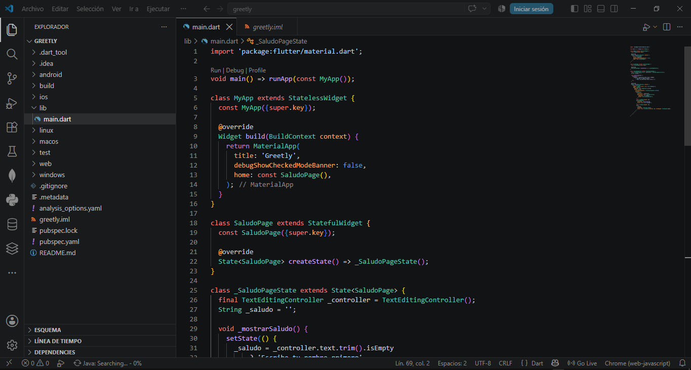
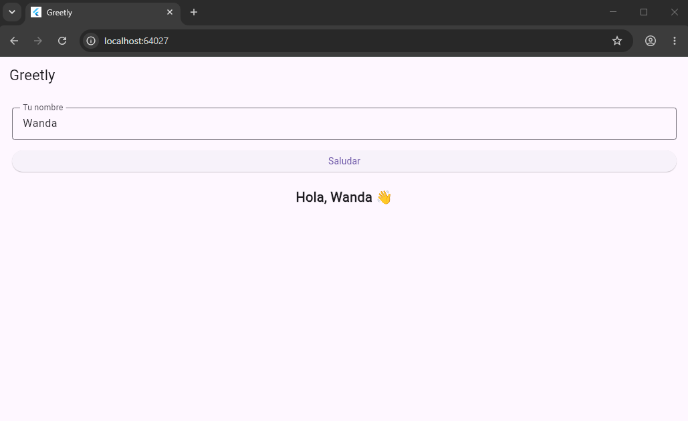

# Greetly

App Flutter simple que practica **widgets básicos**: `Text`, `TextField` (Input) y `ElevatedButton` (Button).

## 🖼️ Código

## ▶️ App corriendo

## 🔗 Repositorio

[github.com/JeffersonRnd/greetly](https://github.com/JeffersonRnd/greetly)