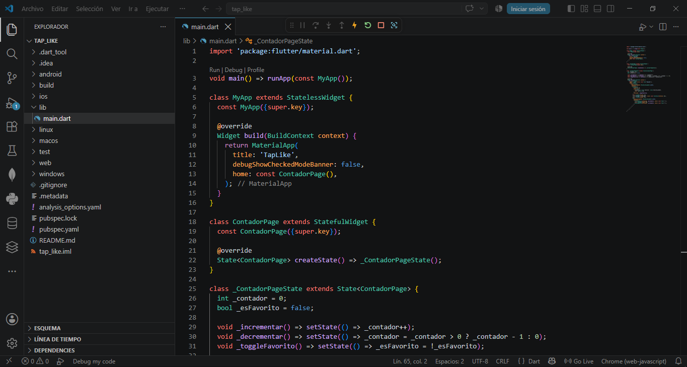
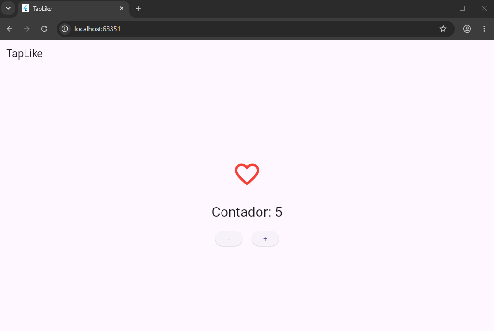

# TapLike

App Flutter simple que practica **StatefulWidget** y el manejo de estado con `setState()`.

## 🖼️ Código

## ▶️ App corriendo

## 🔗 Repositorio

[github.com/JeffersonRnd/tap_like](https://github.com/JeffersonRnd/tap_like)